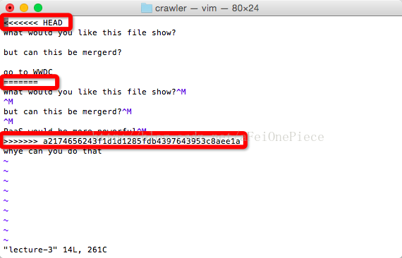

word  
word  
word  
word  
word  
word  
word  
word  
word  
word  
word  
word  
word  
word  
word  
word  
word  
word  
word  
word  
word  
word  
word  
word  
word  
word  
word  
word  
word  
word  
word  
word  
word  
word  
word  
word  
word  
word  
word  
word  

# make


## 从远程仓库获取

* 把远端仓库fetch下来，同时merge

```
$ git pull origin master    
```

* 或者用fetch + merge  
* origin/master就是远端（github）上面的仓库，master就是本地的仓库  

```
$ git fetch orgin  
$ git merge master origin/master  
```

## git merge冲突
自动合并失败，需要手动解决冲突

* 冲突查看
```
$ git diff
```

* 解决冲突。编辑冲突文件，把冲突的部分删掉或者修改掉


上图中被红框标记的部分，前两个红框之间的部分，是本地的内容。  
后两个红框之间的部分，是origin/master远端的内容。怎么修改决定于你。但是最后要把红框的内容删除  


## 推送到远程仓库
* push file to the master of remote reposity

```
$ git add lecture-3
$ git commit -m “bbbbb"
$ git push origin master
```

* 将本地test分支设置为upstream，推送到远程仓库

```
git push --set-upstream origin test  
```
